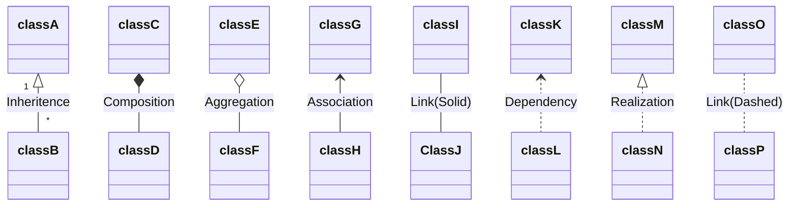
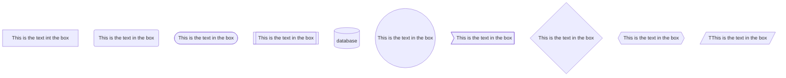
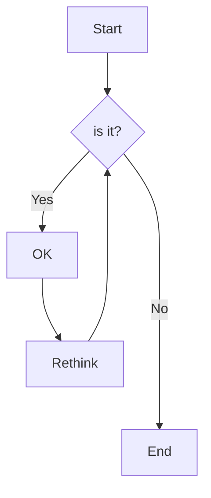
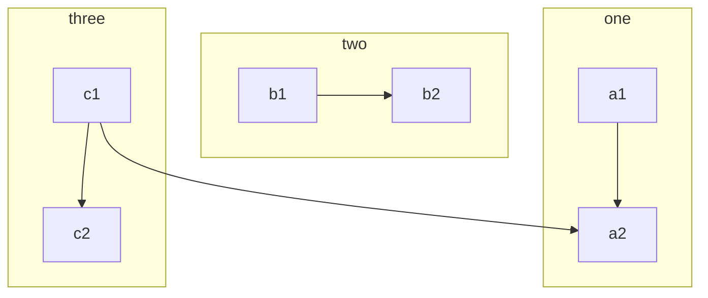

## What is this?

This is a document using "mermaid.js" for writing diagrams.

```mermaid
classDiagram
classA "1" <|-- "*" classB : Inheritence
classC *-- classD : Composition
classE o-- classF : Aggregation
classG <-- classH : Association
classI -- ClassJ : Link(Solid)
classK <.. classL : Dependency
classM <|.. classN : Realization 
classO .. classP : Link(Dashed)
```

```mermaid
flowchart
    id1[This is the text int the box]
    id2(This is the text in the box)
    id3([This is the text in the box])
    id4[[This is the text in the box]]
    id5[(database)]
    id6((This is the text in the box))
    id7>This is the text in the box]
    id8{This is the text in the box}
    id9{{This is the text in the box}}
    id10[/TThis is the text in the box/]
```

```mermaid
flowchart
    A[Start] --> B{is it?}
    B --> |Yes| C[OK]
    C --> D[Rethink]
    D --> B
    B ----> |No| E[End]
```

```mermaid
flowchart 
    c1 --> a2
    subgraph one
        a1 --> a2
    end
    subgraph two
        b1 --> b2
    end
    subgraph three
        c1 --> c2
    end
```