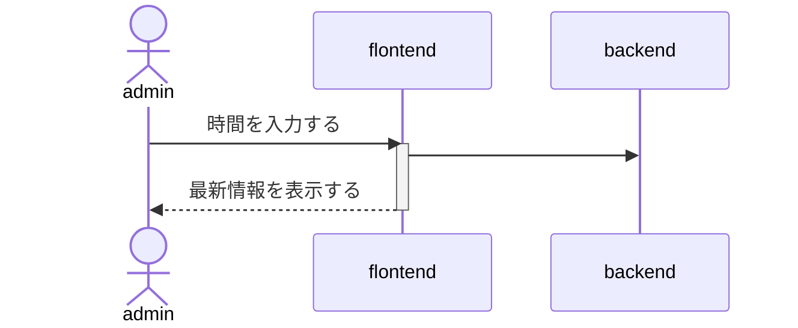
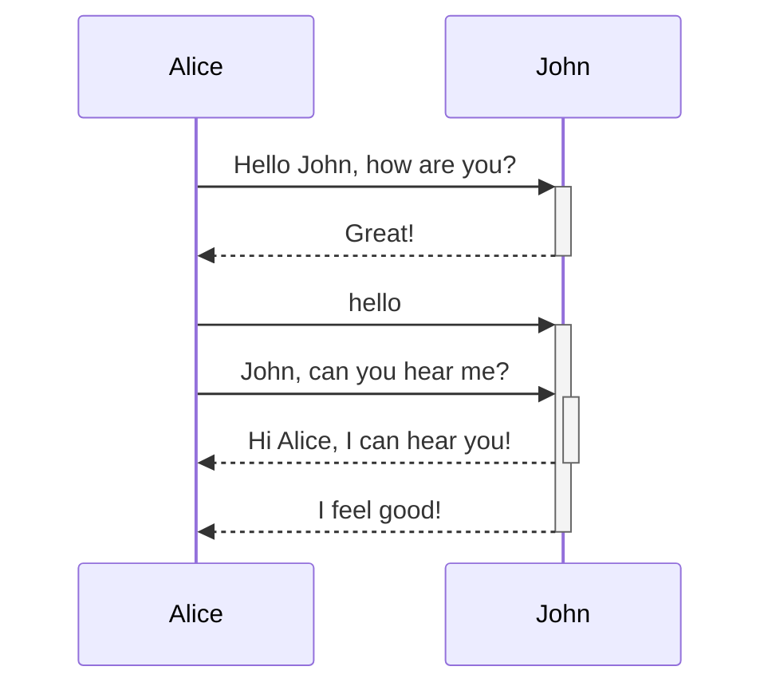
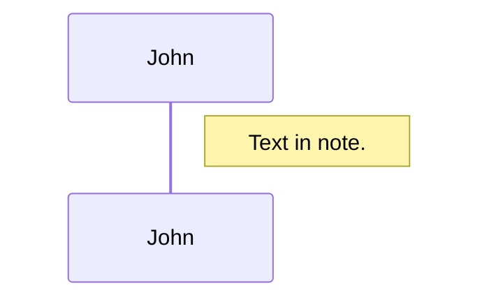
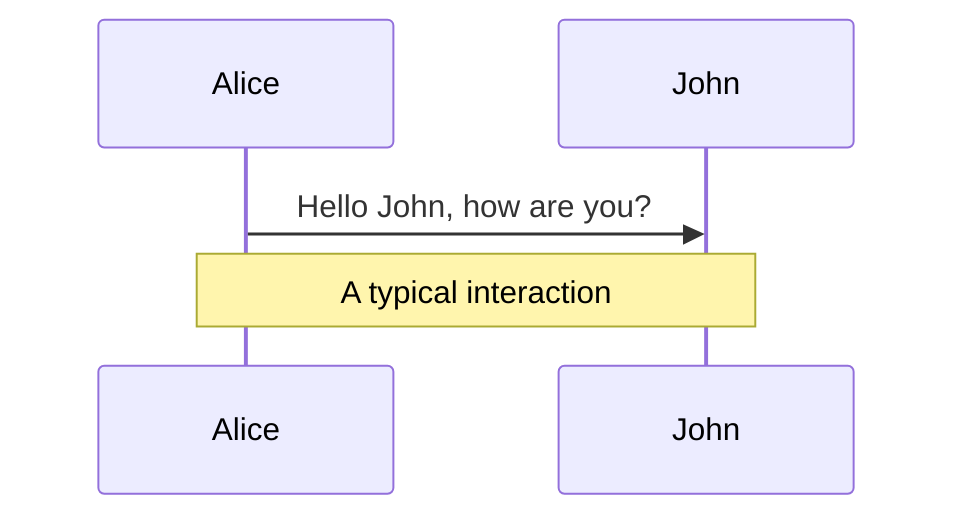
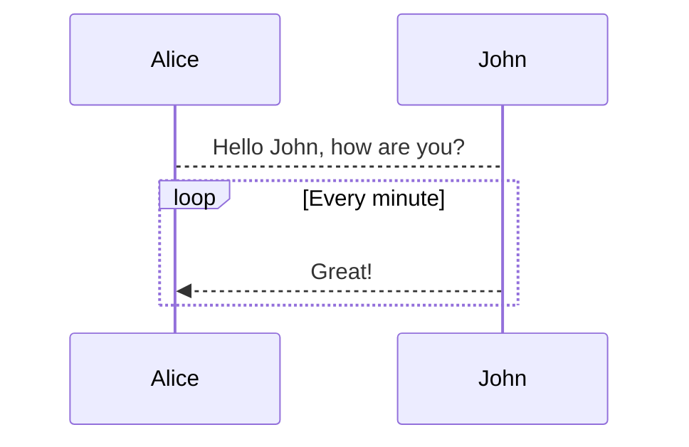
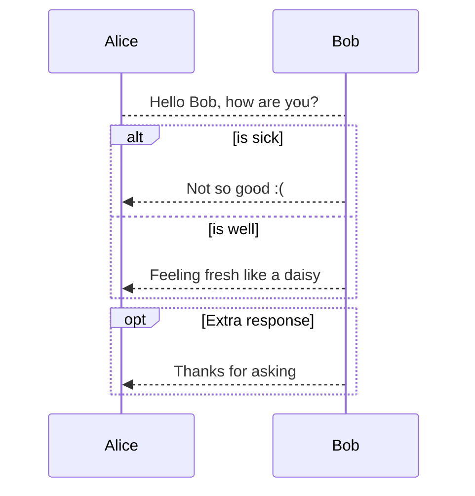
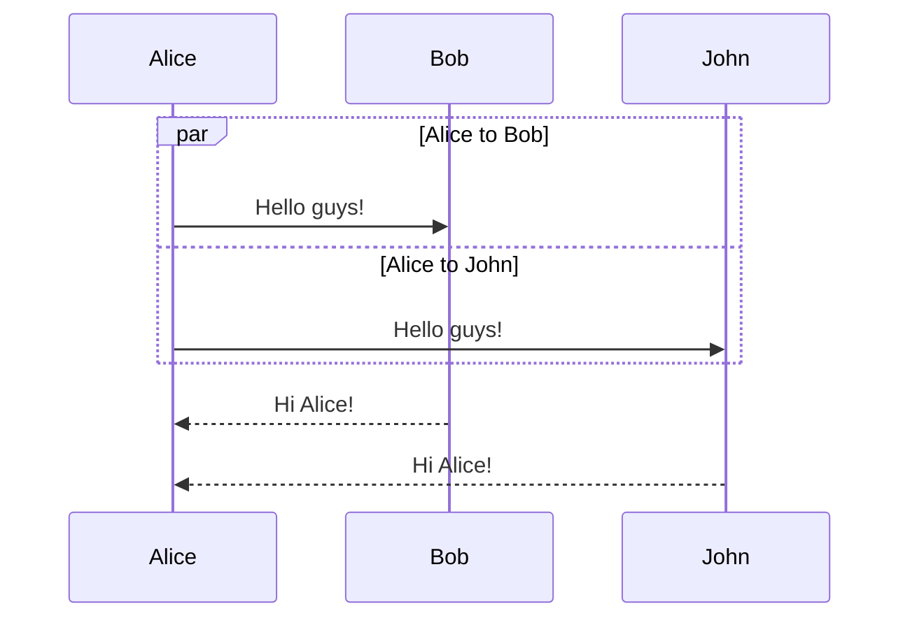
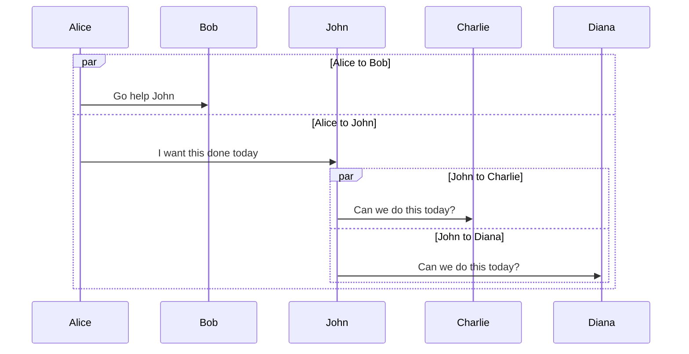
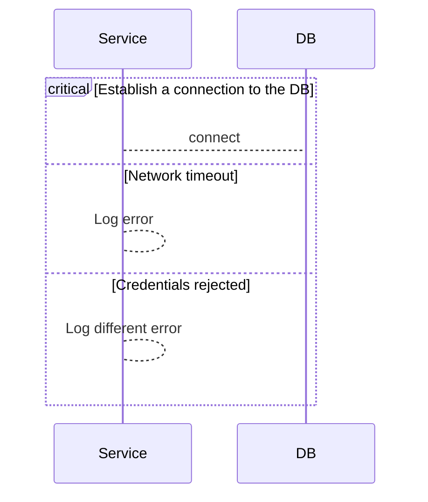
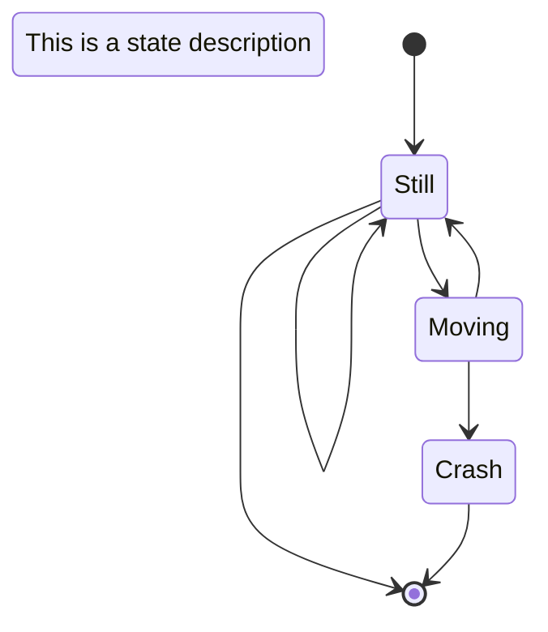

## シーケンス図

Sequence図は `[Actor(Participant)][Arrow][Actor(Participant)] : Message text` と オブジェクト間を定義した後に コロン + スペース `: `
を付けないと認識しない

```mermaid
sequenceDiagram
    actor admin
    participant flontend
    participant backend
    admin ->> flontend : 時間を入力する
    activate flontend
    flontend ->> backend :  
    flontend -->> admin : 最新情報を表示する
    deactivate flontend
```

```mermaid
sequenceDiagram
    Alice ->>+ John : Hello John, how are you?
    John -->>- Alice : Great!
    
    Alice ->>+ John : hello
    Alice ->>+ John : John, can you hear me?
    John -->>- Alice : Hi Alice, I can hear you!
    John -->>- Alice : I feel good! 
```

```mermaid
sequenceDiagram
    participant John
    Note right of John : Text in note.
```

```mermaid
sequenceDiagram
    Alice ->> John : Hello John, how are you?
    Note over Alice, John: A typical interaction
```

```mermaid
sequenceDiagram
    Alice --> John : Hello John, how are you?
    loop Every minute
        John -->> Alice : Great!
    end
```

```mermaid
sequenceDiagram
    Alice --> Bob: Hello Bob, how are you?
    alt is sick
        Bob -->> Alice: Not so good :(
    else is well
        Bob -->> Alice: Feeling fresh like a daisy
    end
    opt Extra response
        Bob -->> Alice: Thanks for asking
    end
```

```mermaid
sequenceDiagram
    par Alice to Bob
        Alice ->> Bob: Hello guys!
    and Alice to John
        Alice ->> John: Hello guys!
    end
    Bob -->> Alice : Hi Alice!
    John -->> Alice : Hi Alice!
```

```mermaid
sequenceDiagram
    par Alice to Bob
        Alice ->> Bob: Go help John
    and Alice to John
        Alice ->> John: I want this done today
        par John to Charlie
            John ->> Charlie: Can we do this today?
        and John to Diana
            John ->> Diana: Can we do this today?
        end
    end
```

<!-- criticalがSyntax errorになる -->

```mermaid
sequenceDiagram
    critical Establish a connection to the DB
        Service-->DB: connect
    option Network timeout
        Service-->Service: Log error
    option Credentials rejected
        Service-->Service: Log different error
    end
```

```mermaid
stateDiagram-v2
    s2: This is a state description
    [*] --> Still
    Still --> [*]
    Still --> Still
    Still --> Moving
    Moving --> Still
    Moving --> Crash
    Crash --> [*]
``` 